  <a href="https://github.com/Toufiq-7700">
    <picture>
      <source media="(prefers-color-scheme: dark)" srcset="./dark.svg">
      <source media="(prefers-color-scheme: light)" srcset="./light.svg">
      
    </picture>
  </a>

<!-- Add any additional profile widgets, stats, or text below! -->

---

### 🌟 About Me  
> I’m **Toufiq**, a passionate learner exploring the world of **Artificial Intelligence** and **Machine Learning**.  
> I enjoy solving problems through coding and understanding how technology can make everyday life smarter.  
> I’m constantly improving my skills by practicing algorithms, data structures, and real-world projects.  
> My goal is to build intelligent and efficient solutions that combine creativity, logic, and impact.  

---

### 📊 My LeetCode Stats  

  

---

### 🌐 Connect with Me  

  
  &nbsp;&nbsp;
  
  &nbsp;&nbsp;
  

---

  ⭐ <i>Profile Views</i>  
  

